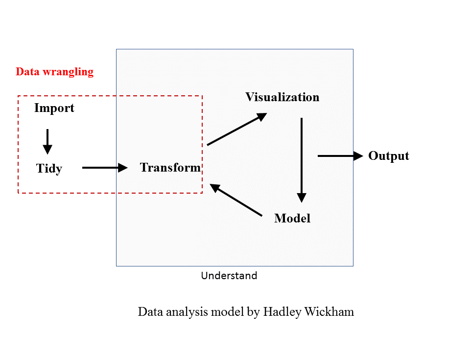

# What is data wrangling?

## Data analysis workflow

A common workflow for data analysis involves importing data, cleaning data, transforming data, visualizing and modeling data for reports or papers. 

If you have not worked with R before, you may use excel to do data cleaning and do simple tranformation work with pivot tables and save the results in a new spreadsheet. You can also draw bar charts, pie charts and histrograms in the spreadsheet. One thing I feel annoying is that in order to keep a record of what you have done, you need to store a couple of sheets inside a workbook. Still, you can miss some steps and cannot recall you have done after a month.

When you need to do more complex stats modeling like ANOVA or linear regression, you may import the spreadsheet into SPSS and other stats packages.But if the data are not arranged in the way as required by these packages, chances are that you will have to go back to Excel again.

If you are lucky and you get all the analysis done. Usually at the end of the project, you will find a number of .xsl or .csv files in your **data** folder. You may name them with the analysis you do or the date you generate them. But after six months, you may feel unsure about what is in these files, not to mention, others who want to reuse it.

But if you are using R, things can be easiler because each step in the data analysis is recorded and fully reproducible.


```{r figure2, fig.cap='Data analysis workflow', out.width='100%', fig.asp=.75, fig.align='center'}



```


## Data wrangling

Data wrangling (see the above figure in red box) involves some basic procedures (importing, tidying and transforming) in the early stages of data analysis. R,and relevant packages, *tidyverse* in particular, provide a number of functions that can help us deal with data cleaning and tranformation. We will be learning how to use these functions in the follow sessions. 


